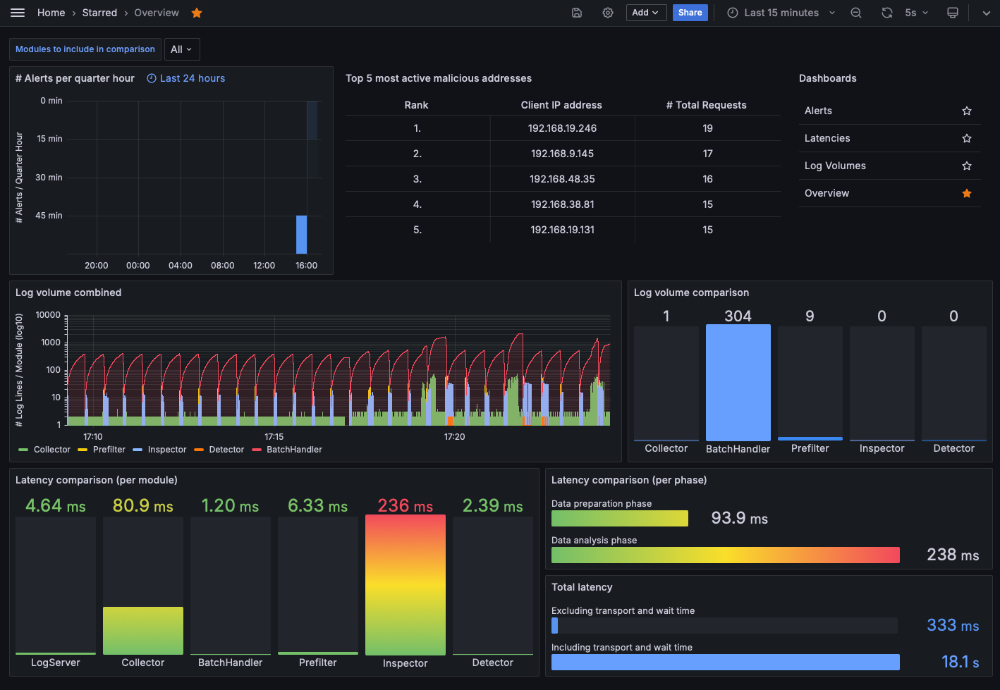
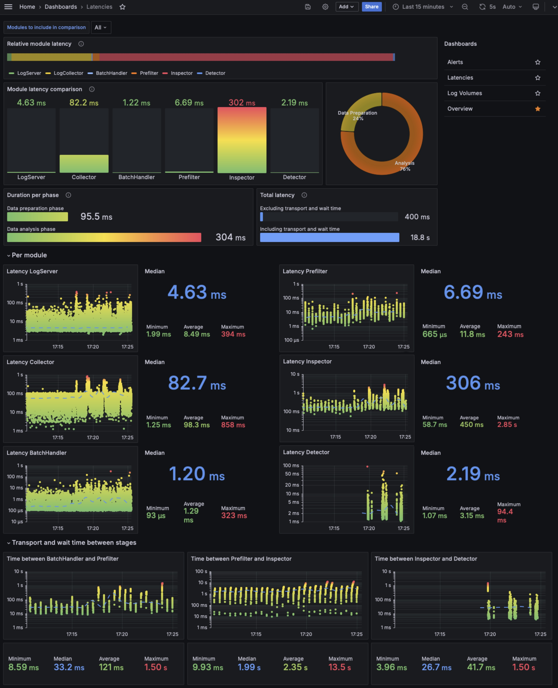
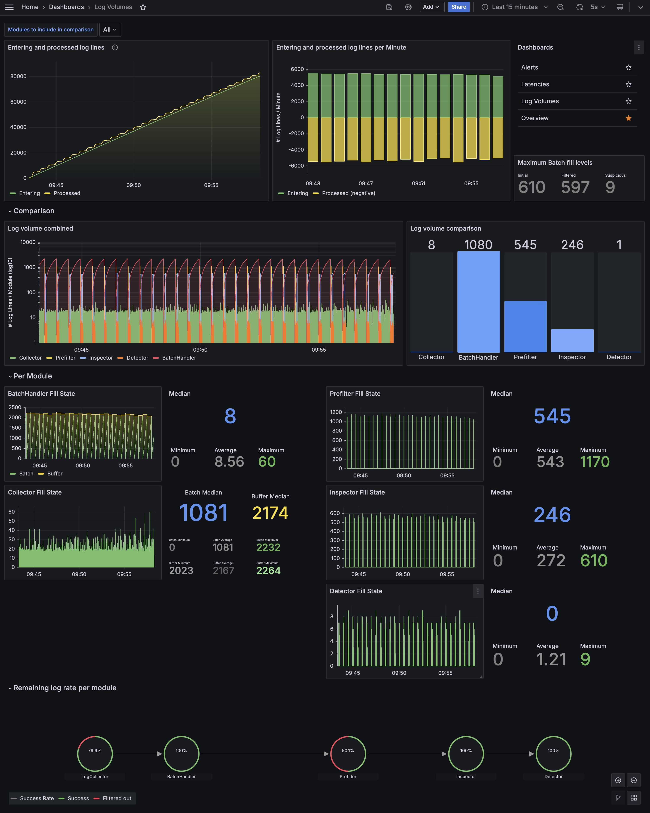
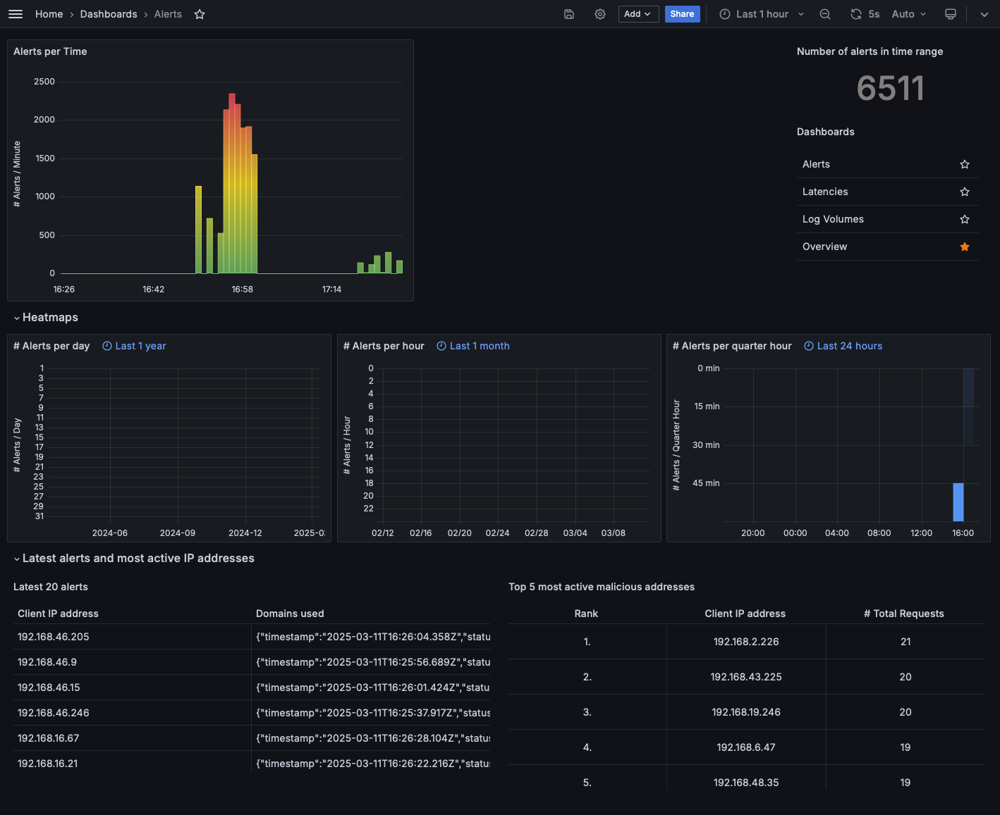
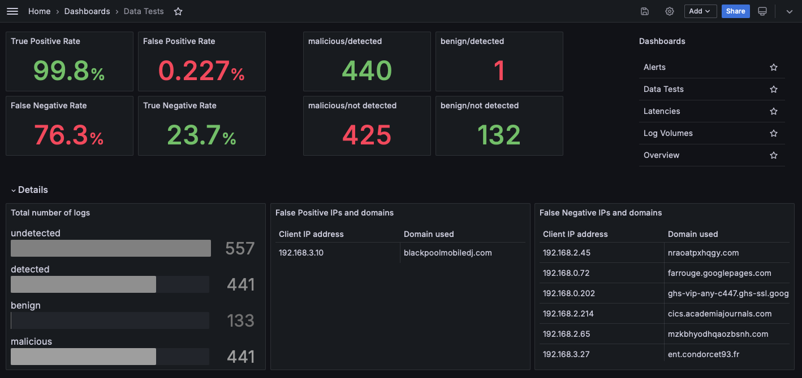

<a id="readme-top"></a>

<!-- PROJECT SHIELDS -->
<div align="center">

[![Codecov Coverage][coverage-shield]][coverage-url]
[![Contributors][contributors-shield]][contributors-url]
[![Forks][forks-shield]][forks-url]
[![Stargazers][stars-shield]][stars-url]
[![Issues][issues-shield]][issues-url]
[![EUPL License][license-shield]][license-url]


</div>

<!-- PROJECT LOGO -->
<br />
<div align="center">
    

<h3 align="center">HAMSTRING</h3>

  <p align="center">
    ...
    <br />
    <a href="https://hamstring.readthedocs.io/en/latest/"><strong>Explore the docs »</strong></a>
    <br />
    <br />
    <a href="https://github.com/hamstring-ndr/hamstring/issues/new?labels=bug&template=bug-report---.md">Report Bug</a>
    ·
    <a href="https://github.com/hamstring-ndr/hamstring/issues/new?labels=enhancement&template=feature-request---.md">Request Feature</a>
  </p>
</div>


<table>
<tr>
  <td><b>Continuous Integration</b></td>
  <td>
    <a href="https://github.com/hamstring-ndr/hamstring/actions/workflows/build_test_linux.yml">
    
    </a>
    <a href="https://github.com/hamstring-ndr/hamstring/actions/workflows/build_test_macos.yml">
    
    </a>
    <a href="https://github.com/hamstring-ndr/hamstring/actions/workflows/build_test_windows.yml">
    
    </a>
  </td>
</tr>
</table>

## About the Project


## Getting Started

#### Run **HAMSTRING** using Docker Compose:
```sh
HOST_IP=127.0.0.1 docker compose -f docker/docker-compose.yml --profile prod up
```
<p align="center">
  
</p>

#### Use the dev profile for testing out changes in docker containers:
```sh
HOST_IP=127.0.0.1 docker compose -f docker/docker-compose.yml --profile dev up
```

<p align="right">(<a href="#readme-top">back to top</a>)</p>


## Usage

### Configuration

To configure **HAMSTRING** according to your needs, use the provided `config.yaml`.

The most relevant settings are related to your specific log line format, the model you want to use, and
possibly infrastructure.

The section `pipeline.log_collection.collector.logline_format` has to be adjusted to reflect your specific input log
line format. Using our adjustable and flexible log line configuration, you can rename, reorder and fully configure each
field of a valid log line. Freely define timestamps, RegEx patterns, lists, and IP addresses. For example, your
configuration might look as follows:

```yml
- [ "timestamp", Timestamp, "%Y-%m-%dT%H:%M:%S.%fZ" ]
- [ "status_code", ListItem, [ "NOERROR", "NXDOMAIN" ], [ "NXDOMAIN" ] ]
- [ "client_ip", IpAddress ]
- [ "dns_server_ip", IpAddress ]
- [ "domain_name", RegEx, '^(?=.{1,253}$)((?!-)[A-Za-z0-9-]{1,63}(?<!-)\.)+[A-Za-z]{2,63}$' ]
- [ "record_type", ListItem, [ "A", "AAAA" ] ]
- [ "response_ip", IpAddress ]
- [ "size", RegEx, '^\d+b$' ]
```

The options `pipeline.data_inspection` and `pipeline.data_analysis` are relevant for configuring the model. The section
`environment` can be fine-tuned to prevent naming collisions for Kafka topics and adjust addressing in your environment.

For more in-depth information on your options, have a look at our
[official documentation](https://hamstring.readthedocs.io/en/latest/usage.html), where we provide tables explaining all
values in detail.


### Testing Your Own Data

If you want to ingest data to the pipeline, you can do so via the zeek container. Either select the interface in the `config.yaml` zeek should be listening on and set `static_analysis: false` or provide PCAPs to Zeek by adding them in the `data/test_pcaps` directory, which is mounted per default for Zeek to ingest static data.

### Monitoring
To monitor the system and observe its real-time behavior, multiple Grafana dashboards have been set up.

Have a look at the following pictures showing examples of how these dashboards might look at runtime.

<details>
  <summary><strong>Overview</strong> dashboard</summary>

  Contains the most relevant information on the system's runtime behavior, its efficiency and its effectivity.

  <p align="center">
    <a href="./assets/readme_assets/overview.png">
      
    </a>
  </p>

</details>

<details>
  <summary><strong>Latencies</strong> dashboard</summary>

  Presents any information on latencies, including comparisons between the modules and more detailed,
  stand-alone metrics.

  <p align="center">
    <a href="./assets/readme_assets/latencies.jpeg">
      
    </a>
  </p>

</details>

<details>
  <summary><strong>Log Volumes</strong> dashboard</summary>

  Presents any information on the fill levels of each module, i.e. the number of entries that are currently in the
  module for processing. Includes comparisons between the modules, more detailed, stand-alone metrics, as well as
  total numbers of logs entering the pipeline or being marked as fully processed.

  <p align="center">
    <a href="./assets/readme_assets/log_volumes.jpeg">
      
    </a>
  </p>

</details>

<details>
  <summary><strong>Alerts</strong> dashboard</summary>

  Presents details on the number of logs detected as malicious including IP addresses responsible for those alerts.

  <p align="center">
    <a href="./assets/readme_assets/alerts.png">
      
    </a>
  </p>

</details>

<details>
  <summary><strong>Dataset</strong> dashboard</summary>

  This dashboard is only active for the **_datatest_** mode. Users who want to test their own models can use this mode
  for inspecting confusion matrices on testing data.

  > This feature is in a very early development stage.

  <p align="center">
    <a href="./assets/readme_assets/datatests.png">
      
    </a>
  </p>

</details>

<p align="right">(<a href="#readme-top">back to top</a>)</p>


## Models and Training

To train and test our and possibly your own models, we currently rely on the following datasets:

- [DGTA Benchmark](https://data.mendeley.com/datasets/2wzf9bz7xr/1)
- [DNS Tunneling Queries for Binary Classification](https://data.mendeley.com/datasets/mzn9hvdcxg/1)
- [UMUDGA - University of Murcia Domain Generation Algorithm Dataset](https://data.mendeley.com/datasets/y8ph45msv8/1)
- [DGArchive](https://dgarchive.caad.fkie.fraunhofer.de/)
- [DNS Exfiltration](https://data.mendeley.com/datasets/c4n7fckkz3/3)

We compute all features separately and only rely on the `domain` and `class` for binary classification.

### Inserting Data for Testing

For testing purposes, you can ingest PCAPs or tap on network interfaces using the zeek-based sensor in its `1.0.0` release. For more information on it, please refer to [the documentation](https://github.com/Hamstring-NDR/hamstring-zeek).

### Training Your Own Models

> [!IMPORTANT]
> This is only a brief wrap-up of a custom training process.
> We highly encourage you to have a look at the [documentation](https://hamstring.readthedocs.io/en/latest/training.html)
> for a full description and explanation of the configuration parameters.

We feature two trained models:
1. XGBoost (`src/train/model.py#XGBoostModel`) and
2. RandomForest (`src/train/model.py#RandomForestModel`).

After installing the requirements, use `src/train/train.py`:

```sh
> python -m venv .venv
> source .venv/bin/activate

> pip install -r requirements/requirements.train.txt

> python src/train/train.py
Usage: train.py [OPTIONS] COMMAND [ARGS]...

Options:
  -h, --help  Show this message and exit.

Commands:
  explain
  test
  train
```

Setting up the [dataset directories](#insert-test-data) (and adding the code for your model class if applicable) lets you start
the training process by running the following commands:

#### Model Training

```sh
> python src/train/train.py train  --dataset <dataset_type> --dataset_path <path/to/your/datasets> --model <model_name>
```
The results will be saved per default to `./results`, if not configured otherwise.

#### Model Tests

```sh
> python src/train/train.py test  --dataset <dataset_type> --dataset_path <path/to/your/datasets> --model <model_name> --model_output_path <path_to_model_version>
```

#### Model Explain

```sh
> python src/train/train.py explain  --dataset <dataset_type> --dataset_path <path/to/your/datasets> --model <model_name> --model_path <path_to_model_version>
```
This will create a `rules.txt` file containing the innards of the model, explaining the rules it created.

<p align="right">(<a href="#readme-top">back to top</a>)</p>


### Data

> [!IMPORTANT]
> We support custom schemes.

Depending on your data and usecase, you can customize the data scheme to fit your needs.
The below configuration is part of the [main configuration file](./config.yaml) which is detailed in our [documentation](https://HAMSTRING.readthedocs.io/en/latest/usage.html#id2)

```yml
loglines:
  fields:
    - [ "timestamp", RegEx, '^\d{4}-\d{2}-\d{2}T\d{2}:\d{2}:\d{2}\.\d{3}Z$' ]
    - [ "status_code", ListItem, [ "NOERROR", "NXDOMAIN" ], [ "NXDOMAIN" ] ]
    - [ "src_ip", IpAddress ]
    - [ "dns_server_ip", IpAddress ]
    - [ "domain_name", RegEx, '^(?=.{1,253}$)((?!-)[A-Za-z0-9-]{1,63}(?<!-)\.)+[A-Za-z]{2,63}$' ]
    - [ "record_type", ListItem, [ "A", "AAAA" ] ]
    - [ "response_ip", IpAddress ]
    - [ "size", RegEx, '^\d+b$' ]
```


<p align="right">(<a href="#readme-top">back to top</a>)</p>

<!-- CONTRIBUTING -->
## Contributing

Contributions are what make the open source community such an amazing place to learn, inspire, and create. Any
contributions you make are **greatly appreciated**.

If you have a suggestion that would make this better, please fork the repo and create a pull request. You can also
simply open an issue with the tag "enhancement".
Don't forget to give the project a star! Thanks again!

### Top contributors:

<a href="https://github.com/hamstring-ndr/hamstring/graphs/contributors">
  
</a>


<p align="right">(<a href="#readme-top">back to top</a>)</p>

<!-- LICENSE -->

## License

Distributed under the EUPL License. See `LICENSE.txt` for more information.

<p align="right">(<a href="#readme-top">back to top</a>)</p>


<!-- MARKDOWN LINKS & IMAGES -->
<!-- https://www.markdownguide.org/basic-syntax/#reference-style-links -->

[contributors-shield]: https://img.shields.io/github/contributors/hamstring-ndr/hamstring.svg?style=for-the-badge

[contributors-url]: https://github.com/hamstring-ndr/hamstring/graphs/contributors

[forks-shield]: https://img.shields.io/github/forks/hamstring-ndr/hamstring.svg?style=for-the-badge

[forks-url]: https://github.com/hamstring-ndr/hamstring/network/members

[stars-shield]: https://img.shields.io/github/stars/hamstring-ndr/hamstring.svg?style=for-the-badge

[stars-url]: https://github.com/hamstring-ndr/hamstring/stargazers

[issues-shield]: https://img.shields.io/github/issues/hamstring-ndr/hamstring.svg?style=for-the-badge

[issues-url]: https://github.com/hamstring-ndr/hamstring/issues

[license-shield]: https://img.shields.io/github/license/hamstring-ndr/hamstring.svg?style=for-the-badge

[license-url]: https://github.com/hamstring-ndr/hamstring/blob/master/LICENSE.txt

[coverage-shield]: https://img.shields.io/codecov/c/github/hamstring-ndr/hamstring?style=for-the-badge

[coverage-url]: https://app.codecov.io/github/hamstring-ndr/hamstring
