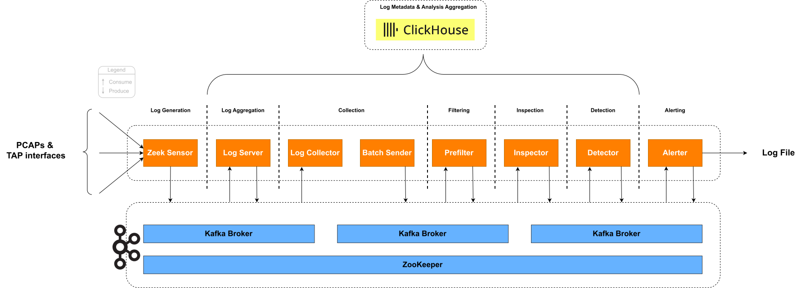

Pipeline
~~~~~~~~

Overview
========

The core component of the software's architecture is its data pipeline. It consists of five stages/modules, and data
traverses through it using Apache Kafka.

Stage 1: Log Aggregation
========================

The Log Aggregation stage harnesses multiple Zeek sensors to ingest data from static (i.e. PCAP files) and dynamic sources (i.e. traffic from network interfaces).
The traffic is split protocolwise into Kafka topics and send to the Logserver for the Log Storage phase.

Overview
--------

The :class:`ZeekConfigurationHandler` takes care of the setup of a containerized Zeek sensor. It reads in the main configuration file and
adjusts the protocols to listen on, the logformats of incoming traffic, and the Kafka queues to send to.

The :class:`ZeekAnalysisHandler` starts the actual Zeek instance. Based on the configuration it either starts Zeek in a cluster for specified network interfaces
or in a single node instance for static analyses.

Main Classes
------------

.. py:currentmodule:: src.zeek.zeek_config_handler
.. autoclass:: ZeekConfigurationHandler

.. py:currentmodule:: src.zeek.zeek_analysis_handler
.. autoclass:: ZeekAnalysisHandler

Usage and configuration
-----------------------

An analysis can be performed via tapping network inerfaces and by injecting pcap files.
To adjust this, adapt the ``pipeline.zeek.sensors.[sensor_name].static_analysis`` value to True or false.

- **``pipeline.zeek.sensors.[sensor_name].static_analysis``** set to True:

  - An static analysis is executed. The PCAP files are extracted from within the GitHub root directory under ``/data/test_pcaps"`` and mounted into the zeek container. All files ending in .PCAP are then read and analyzed by Zeek.
    Please Note that we do not recommend to use several Zeek instances for a static analysis, as the data will be read in multiple times, which impacts the benchmarks accordingly.

- **``pipeline.zeek.sensors.[sensor_name].static_analysis``** set to False:

  - A network analysis is performed for the interfaces listed in ``pipeline.zeek.sensors.[sensor_name].interfaces``

You can start multiple instances of Zeek by adding more entries to the dictionary ``pipeline.zeek.sensors``.
Necessary attributes are:
- ``pipeline.zeek.sensors.[sensor_name].static_analysis`` : **bool**
- if not static analysis: ``pipeline.zeek.sensors.[sensor_name].interfaces`` : **list**
- ``pipeline.zeek.sensors.[sensor_name].protocols`` : **list**

Stage 2: Log Storage
====================

This stage serves as the central ingestion point for all data.

Overview
--------

The :class:`LogServer` class is the core component of this stage. It reads the Zeek Sensors inputs and directs them via Kafka to the following stages.

Main Class
----------

.. py:currentmodule:: src.logserver.server
.. autoclass:: LogServer

Usage and configuration
-----------------------

Currently, the :class:`LogServer` reads from the Kafka Queues specified by Zeek. These have a common prefix, specified in ``environment.kafka_topics_prefix.pipeline.logserver_in``. The suffix is the protocol name in lower case of the traffic.
The Logserver has no further configuration.

The :class:`LogServer` simultaneously listens on a Kafka topic and reads from an input file. The configuration
allows changing the Kafka topic to listen on, as well as the file name to read from.

The Kafka topic to listen on takes input by Zeek. The traffic is split protocolwise, thus there are severa topics to listen to.
These have a common prefix, specified in ``environment.kafka_topics_prefix.pipeline.logserver_in``. The suffix is the protocol name in lower case of the traffic.

Stage 3: Log Collection
=======================

The Log Collection stage validates and processes incoming loglines from the Log Storage stage, organizes them into
batches based on subnet IDs, and forwards them to the next pipeline stage for further analysis.

Core Functionality
------------------

The `Log Collection` stage is responsible for retrieving loglines from the :ref:`Log Storage<stage-1-log-storage>`,
parsing their information fields, and validating the data. Each field is checked to ensure it is of the correct type
and format. This stage ensures that all data is accurate, reducing the need for further verification
in subsequent stages.

Data Processing and Validation
..............................

Any loglines that do not meet the required format are immediately discarded to maintain data integrity. The
validation process includes data type verification and value range checks (e.g., verifying that IP addresses are
valid). Only validated loglines proceed to the batching phase.

Batching and Performance Optimization
.....................................

Valid loglines are buffered and transmitted in batches after a pre-defined timeout or when the buffer reaches its
capacity. This minimizes the number of messages sent to the next stage and optimizes performance. The client's IP
address is retrieved from the logline and used to create the ``subnet_id`` with the number of subnet bits specified
in the configuration.

Advanced Features
.................

The functionality of the buffer system is detailed in the subsection :ref:`buffer-functionality`. This approach helps
detect errors or attacks that may occur at the boundary between two batches when analyzed in later pipeline stages.

Overview
--------

The `Log Collection` stage comprises three main classes:

1. :class:`LogCollector`: Connects to the :class:`LogServer` to retrieve and parse loglines, validating their format
   and content. Adds ``subnet_id`` that it retrieves from the client's IP address in the logline.
2. :class:`BufferedBatch`: Buffers validated loglines with respect to their ``subnet_id``. Maintains the timestamps for
   accurate processing and analysis per key (``subnet_id``). Returns sorted batches.
3. :class:`BufferedBatchSender`: Adds messages to the data structure :class:`BufferedBatch`, maintains the timer
   and checks the fill level of the key-specific batches. Sends the key's batches if full, sends all batches at timeout.

Main Classes
------------

.. py:currentmodule:: src.logcollector.collector
.. autoclass:: LogCollector

.. py:currentmodule:: src.logcollector.batch_handler
.. autoclass:: BufferedBatch

.. py:currentmodule:: src.logcollector.batch_handler
.. autoclass:: BufferedBatchSender

Usage
-----

LogCollector
............

The :class:`LogCollector` connects to the :class:`LogServer` to retrieve one logline, which it then processes and
validates. The logline is parsed into its respective fields, each checked for correct type and format.
For each configuration of a logg collector in ``pipeline.logcollection.collectors``, a process is spun up in the resulting docker container
allowing for multiprocessing and threading.

- **Field Validation**:

  - Checks include data type verification and value range checks (e.g., verifying that an IP address is valid).
  - Only loglines meeting the criteria are forwarded to the :class:`BufferedBatchSender`.

- **Subnet Identification**:

  - The configuration file specifies the number n of bits in a subnet (e.g. 24). The client's IP address serves as a
    base for the ``subnet_id``. For this, the initial IP address is cut off after n bits, the rest is filled with
    zeros, and ``_n`` is added to the end of the ``subnet_id``. For example:

    +------------------------+------------------------------------------------+
    | **Client IP address**  | **Subnet ID**                                  |
    +========================+================================================+
    | ``171.154.4.17``       | ``171.154.4.0_24``                             |
    +------------------------+------------------------------------------------+

- **Connection to LogServer**:

  - The :class:`LogCollector` establishes a connection to the :class:`LogServer` and retrieves loglines when they
    become available.

- **Log Line Format**:

  As the log information differs for each protocol, there is a default format per protocol.
  This can be either adapted or a completely new one can be added as well. For more information
  please reffer to section :ref:`Logline format configuration`.

    .. code-block::

        DNS default logline format

        TS STATUS SRC_IP DNS_IP HOST_DOMAIN_NAME RECORD_TYPE RESPONSE_IP SIZE

    +----------------------+------------------------------------------------+
    | **Field**            | **Description**                                |
    +======================+================================================+
    | ``TS``               | The date and time when the log entry was       |
    |                      | recorded. Formatted as                         |
    |                      | ``YYYY-MM-DDTHH:MM:SS.sssZ``.                  |
    |                      |                                                |
    |                      | - **Default Format**: ``%Y-%m-%dT%H:%M:%S.%fZ``|
    |                      |   (ISO 8601 with microseconds and UTC).        |
    |                      | - **Example**: ``2024-07-28T14:45:30.123456Z`` |
    |                      |                                                |
    |                      | The format can be customized by modifying the  |
    |                      | timestamp configuration in the pipeline        |
    |                      | configuration file.                            |
    +----------------------+------------------------------------------------+
    | ``STATUS``           | The status of the DNS query, e.g., ``NOERROR``,|
    |                      | ``NXDOMAIN``.                                  |
    +----------------------+------------------------------------------------+
    | ``SRC_IP``        | The IP address of the client that made the        |
    |                      | request.                                       |
    +----------------------+------------------------------------------------+
    | ``DNS_IP``           | The IP address of the DNS server processing    |
    |                      | the request.                                   |
    +----------------------+------------------------------------------------+
    | ``HOST_DOMAIN_NAME`` | The domain name being queried.                 |
    +----------------------+------------------------------------------------+
    | ``RECORD_TYPE``      | The type of DNS record requested, such as ``A``|
    |                      | or ``AAAA``.                                   |
    +----------------------+------------------------------------------------+
    | ``RESPONSE_IP``      | The IP address returned in the DNS response.   |
    +----------------------+------------------------------------------------+
    | ``SIZE``             | The size of the DNS query response in bytes.   |
    |                      | Represented in the format like ``150b``, where |
    |                      | the number indicates the size and ``b`` denotes|
    |                      | bytes.                                         |
    +----------------------+------------------------------------------------+

    .. code-block::

        HTTP default logline format

        TS SRC_IP SRC_PORT DST_IP DST_PORT METHOD URI STATUS_CODE REQUEST_BODY RESPONSE_BODY

    +----------------------+------------------------------------------------+
    | **Field**            | **Description**                                |
    +======================+================================================+
    | ``TS``        | The date and time when the log entry was              |
    |                      | recorded. Formatted as                         |
    |                      | ``YYYY-MM-DDTHH:MM:SS.sssZ``.                  |
    |                      |                                                |
    |                      | - **Format**: ``%Y-%m-%dT%H:%M:%S.%f`` (with   |
    |                      |   microseconds truncated to milliseconds).     |
    |                      | - **Time Zone**: ``Z``                         |
    |                      |   indicates Zulu time (UTC).                   |
    |                      | - **Example**: ``2024-07-28T14:45:30.123Z``    |
    |                      |                                                |
    |                      | This format closely resembles ISO 8601, with   |
    |                      | milliseconds precision.                        |
    +----------------------+------------------------------------------------+
    | ``SRC_IP``           | The IP address of the client that made the     |
    |                      | request.                                       |
    +----------------------+------------------------------------------------+
    | ``SRC_PORT``         | The source port of the cliend making the       |
    |                      | request                                        |
    +----------------------+------------------------------------------------+
    | ``DST_IP``           | The IP address of the target server for the    |
    |                      | request.                                       |
    +----------------------+------------------------------------------------+
    | ``DST_PORT``         | The port of the target server                  |
    +----------------------+------------------------------------------------+
    | ``METHOD``           | The HTTP method used (e.g. ``GET, POST``)      |
    +----------------------+------------------------------------------------+
    | ``URI``              | Path accessed in the request (e.g. ``/admin``) |
    +----------------------+------------------------------------------------+
    | ``STATUS_CODE``      | The HTTP status code returned (e.g. ``500``)   |
    +----------------------+------------------------------------------------+
    | ``REQUEST_BODY``     | The HTTP request payload (might be encrypted)  |
    +----------------------+------------------------------------------------+
    | ``RESPONSE_BODY``    | The HTTP response body (might be encrypted)    |
    +----------------------+------------------------------------------------+

BufferedBatch
.............

The :class:`BufferedBatch` manages the buffering of validated loglines as well as their timestamps and batch metadata:

- **Batching Logic and Buffering Strategy**:

  - Collects log entries into a ``batch`` dictionary, with the ``subnet_id`` as key.
  - Uses a ``buffer`` per key to concatenate and send both the current and previous batches together.
  - This approach helps detect errors or attacks that may occur at the boundary between two batches when analyzed in
    :ref:`Data-Inspection<inspection_stage>` and :ref:`Data-Analysis<detection_stage>`.
  - All batches get sorted by their timestamps at completion to ensure correct chronological order.
  - A `begin_timestamp` and `end_timestamp` per key are extracted and sent as metadata (needed for analysis). These
    are taken from the chronologically first and last message in a batch.
  - Tracks batch IDs, timestamps, and fill levels for comprehensive monitoring and debugging.

- **Monitoring and Metadata**:

  - Each batch is assigned a unique batch ID for tracking purposes.
  - Logs associations between loglines and their respective batches.
  - Maintains fill level statistics for both batches and buffers.
  - Records batch status changes (waiting, completed) with timestamps.

BufferedBatchSender
...................

The :class:`BufferedBatchSender` manages the sending of validated loglines stored in the :class:`BufferedBatch`:

- **Timer-based and Size-based Triggers**:

  - Starts a timer upon receiving the first log entry.
  - When a batch reaches the configured size (e.g., 1000 entries), the current and previous
    batches of this key are concatenated and sent to the Kafka topic ``batch_sender_to_prefilter``.
  - Upon timer expiration, the currently stored batches of all keys are sent. Serves as backup if batches don't reach
    the configured size.
  - If no messages are present when the timer expires, nothing is sent.

- **Message Processing and Monitoring**:

  - Extracts logline IDs from JSON messages for tracking purposes.
  - Logs processing timestamps (in_process, batched) for each message.
  - Provides detailed logging about the number of messages and batches sent.
  - Uses the Batch schema for serialization before sending to Kafka.

Configuration
-------------

The instances of the class :class:`LogCollector` check the validity of incoming loglines. For this, they use the ``required_log_information`` configured
in the ``config.yaml``.

Configurations can arbitrarily added, adjusted and removed. This is especially useful if certain detectors need specialized log fields.
The following convention needs to be sticked to:

- Each entry in the ``required_log_information``  needs to be a list
- The first item is the name of the datafield as adjusted in Zeek
- The second item is the Class name the value should be mapped to for validation
- Depending on the class, the third item is a list of valid inputs
- Depending on the class, the fourth item is a list of relevant inputs

.. _buffer-functionality:

Buffer Functionality
--------------------

The :class:`BufferedBatch` class manages the batching and buffering of messages associated with specific keys, along
with the corresponding timestamps. The class ensures efficient data processing by maintaining two sets of messages -
those currently being batched and those that were part of the previous batch. It also tracks the necessary timestamps
to manage the timing of message processing.

Class Overview
..............

- **Batch**: Stores the latest incoming messages associated with a particular key.

- **Buffer**: Stores the previous batch of messages associated with a particular key.

- **Batch ID**: Unique identifier assigned to each batch for tracking and monitoring purposes.

- **Monitoring Databases**: Tracks logline-to-batch associations, batch timestamps, and fill levels for comprehensive monitoring.

Key Procedures
..............

1. **Message Arrival and Addition**:

  - When a new message arrives, the ``add_message()`` method is called.
  - If the key already exists in the batch, the message is appended to the list of messages for that key.
  - If the key does not exist, a new entry is created in the batch with a unique batch ID.
  - Batch timestamps and logline-to-batch associations are logged for monitoring.
  - **Example**:

    - ``message_1`` arrives for ``key_1`` and is added to ``batch["key_1"]``.

2. **Retrieving Message Counts**:

  - Use ``get_message_count_for_batch_key(key)`` to get the count of messages in the current batch for a specific key.
  - Use ``get_message_count_for_buffer_key(key)`` to get the count of messages in the buffer for a specific key.
  - Use ``get_message_count_for_batch()`` to get the total count across all batches.
  - Use ``get_message_count_for_buffer()`` to get the total count across all buffers.

3. **Completing a Batch**:

  - The ``complete_batch()`` method is called to finalize and retrieve the batch data for a specific key.
  - **Scenarios**:

    - **Variant 1**: If only the current batch contains messages (buffer is empty), the batch is returned sorted by and with its timestamps. ``begin_timestamp`` reflects the timestamp of the first message in the batch, and ``end_timestamp`` the timestamp of the chronologically last message in the batch.
    - **Variant 2**: If both the batch and buffer contain messages, the buffered messages are included in the returned data. The ``begin_timestamp`` now reflects the first message's timestamp in the buffer instead of the batch.
    - **Variant 3**: If only the buffer contains messages (no new messages arrived), the buffer data is discarded.
    - **Variant 4**: If neither the batch nor the buffer contains messages, a ``ValueError`` is raised.

4. **Managing Stored Keys**:

  - The ``get_stored_keys()`` method returns a set of all keys currently stored in either the batch or the buffer, allowing the retrieval of all keys with associated messages or buffered data.

Example Workflow
................

1. **Initial Message**:

  - ``message_1`` arrives for ``key_1``, added to ``batch["key_1"]``.

2. **Subsequent Message**:

  - ``message_2`` arrives for ``key_1``, added to ``batch["key_1"]``.

3. **Completing the Batch**:

  - ``complete_batch("key_1")`` is called, and if ``buffer["key_1"]`` exists, it includes both buffered and batch
    messages, otherwise just the batch.
  - The current batch is moved to the buffer.

4. **Buffer Management**:

  - If no new messages arrive, ``buffer["key_1"]`` data is discarded upon the next call to ``complete_batch("key_1")``.

This class design effectively manages the batching and buffering of messages, allowing for precise timestamp tracking
and efficient data processing across different message streams.

Stage 4: Log Filtering
======================

The Log Filtering stage processes batches from the Log Collection stage and filters out irrelevant entries based on configurable relevance criteria, ensuring only meaningful data proceeds to anomaly detection.

Core Functionality
------------------

The `Log Filtering` stage is responsible for processing and refining log data by filtering out entries based on
relevance criteria defined in the logline format configuration. This step ensures that only relevant logs are passed
on for further analysis, optimizing the performance and accuracy of subsequent pipeline stages.

Data Processing Pipeline
........................

The filtering process operates on complete batches rather than individual loglines, maintaining batch metadata and
timestamps throughout the process. Each batch is processed as a unit, preserving the subnet-based grouping established
in the previous stage.

Relevance-Based Filtering
.........................

The filtering mechanism uses the ``check_relevance()`` method from the :class:`LoglineHandler` to determine which
entries should proceed to the next stage. This approach allows for flexible filtering criteria based on field values
defined in the configuration.

Main Class
----------

.. py:currentmodule:: src.prefilter.prefilter
.. autoclass:: Prefilter

Usage
-----

One :class:`Prefilter` per prefilter configuration in ``pipeline.log_filtering`` is started. Each instance loads from a Kafka topic name that depends on the logcollector the prefilter builds upon.
The prefix for each topic is defined in ``environment.kafka_topics_prefix.batch_sender_to_prefilter.`` and the suffix is the configured log collector name.
The prefilters extract the log entries and apply a filter function (or relevance function) to retain only those entries that match the specified requirements.

Data Flow and Processing
........................

The :class:`Prefilter` consumes batches from the Kafka topic ``batch_sender_to_prefilter`` and processes them through
the following workflow:

1. **Batch Reception**: Receives complete batches with metadata (batch_id, begin_timestamp, end_timestamp, subnet_id)
2. **Relevance Filtering**: Applies relevance checks to each logline within the batch
3. **Monitoring**: Tracks filtered and unfiltered data counts for monitoring purposes
4. **Batch Forwarding**: Sends filtered batches to the ``prefilter_to_inspector`` topic

Filtering Logic
...............

The filtering process:

- Retains loglines that pass the relevance check defined by ``ListItem`` field configurations
- Discards irrelevant loglines and marks them as "filtered_out" in the monitoring system
- Preserves batch structure and metadata for filtered data
- Handles empty batches gracefully (logs info but does not forward empty data)

Error Handling
..............

The implementation includes robust error handling:

- **Empty Data**: Logs informational messages when batches contain no data
- **No Filtered Data**: Raises ``ValueError`` when no relevant data remains after filtering
- **Kafka Exceptions**: Continues processing on message fetch exceptions
- **Graceful Shutdown**: Supports ``KeyboardInterrupt`` for clean termination

Configuration
-------------

To customize the filtering behavior, the relevance function can be extended and adjusted in ``"src/base/logline_handler"`` and can be referenced in the ``"configuration.yaml"`` by the function name.
Checks can be skipped by referencing the ``no_relevance_check`` function.
We currently support the following relevance methods:

    +---------------------------+-------------------------------------------------------------+
    | **Name**                  | **Description**                                             |
    +===========================+=============================================================+
    | ``no_relevance_check ``   | Skip the relevance check of the prefilters entirely.        |
    +---------------------------+-------------------------------------------------------------+
    | ``check_dga_relevance``   | Function to filter requests based on LisItems in the        |
    |                           | logcollector configuration. Using the fourth item in the    |
    |                           | list as a list of relevant status codes, only the request   |
    |                           | and responses are forwarded that include a  **NXDOMAIN**    |
    |                           | status code.                                                |
    +---------------------------+-------------------------------------------------------------+

- **Example Configuration**:

  .. code-block:: yaml

     logline_format:
       - [ "status_code", ListItem, [ "NOERROR", "NXDOMAIN" ], [ "NXDOMAIN" ] ]  # Only NXDOMAIN relevant
       - [ "record_type", ListItem, [ "A", "AAAA" ] ]  # A and AAAA relevant

Monitoring and Metrics
......................

The :class:`Prefilter` provides comprehensive monitoring:

- **Batch Processing**: Tracks batch timestamps and processing status
- **Fill Levels**: Monitors data volumes before and after filtering
- **Logline Tracking**: Records "filtered_out" status for individual loglines
- **Performance Metrics**: Logs processing statistics for each batch

.. _stage-4-inspection:

Stage 5: Inspection
========================
.. _inspection_stage:

Overview
--------

The `Inspector` stage is responsible to run time-series based anomaly detection on prefiltered batches. This stage is essential to reduce
the load on the `Detection` stage. Otherwise, resource complexity increases disproportionately.

Main Classes
------------

.. py:currentmodule:: src.inspector.inspector
.. autoclass:: InspectorAbstractBase

.. py:currentmodule:: src.inspector.inspector
.. autoclass:: InspectorBase

The :class:`InspectorBase` is the primary class for inspecotrs. It holds common functionalities and is responsible for data ingesting, sending, etc.. Any inspector build on top of this
class and needs to implement the methods specified by :class:`InspectorAbstractBase`. The class implementations need to go into ``"/src/inspector/plugins"``

Usage and Configuration
-----------------------

We currently support the following inspectors:

.. list-table::
   :header-rows: 1
   :widths: 15 30 55

   * - **Name**
     - **Description**
     - **Configuration**
   * - ``no_inspector``
     - Skip the anomaly inspection of data entirely.
     - No additional configuration
   * - ``stream_ad_inspector``
     - Uses StreamAD models for anomaly detection. All StreamAD models are supported (univariate, multivariate, ensembles).
     - - ``mode``: univariate (options: multivariate, ensemble)
       - ``ensemble.model``: WeightEnsemble (options: VoteEnsemble)
       - ``ensemble.module``: streamad.process
       - ``ensemble.model_args``: Additional Arguments for the ensemble model
       - ``models.model``: ZScoreDetector
       - ``models.module``: streamad.model
       - ``models.model_args``: Additional arguments for the model
       - ``anomaly_threshold``: 0.01
       - ``score_threshold``: 0.5
       - ``time_type``: streamad.process
       - ``time_range``: 20

Further inspectors can be added and referenced in the config by adjusting the ``pipeline.data_inspection.[inspector].inspector_module_name`` and ``pipeline.data_inspection.[inspector].inspector_class_name``.
Each inspector might need special configurations. For the possible configuration values, please reference the table above.

StreamAD Inspector
...................

The inspector consumes batches on the topic ``inspect``, usually produced by the ``Prefilter``.
For a new batch, it derives the timestamps ``begin_timestamp`` and ``end_timestamp``.
Based on time type (e.g. ``s``, ``ms``) and time range (e.g. ``5``) the sliding non-overlapping window is created.
For univariate time-series, it counts the number of occurances, whereas for multivariate, it considers the number of occurances and packet size. :cite:`schuppen_fanci_2018`

An anomaly is noted when it is greater than a ``score_threshold``.
In addition, we support a relative anomaly threshold.
So, if the anomaly threshold is ``0.01``, it sends anomalies for further detection, if the amount of anomalies divided by the total amount of requests in the batch is greater than ``0.01``.

Time Series Feature Extraction
..............................

The Inspector creates time series features using sliding non-overlapping windows:

- **Time Window Configuration**: Based on ``time_type`` (e.g., ``ms``) and ``time_range`` (e.g., ``20``) from configuration
- **Univariate Mode**: Counts message occurrences per time step for single-feature anomaly detection
- **Multivariate Mode**: Combines message counts and mean packet sizes for two-dimensional feature analysis
- **Ensemble Mode**: Uses message counts with multiple models combined through ensemble methods

Anomaly Detection Logic
.......................

The anomaly detection process evaluates suspicious patterns through a two-level threshold system:

- **Score Threshold**: Individual time steps are flagged as anomalous when scores exceed ``score_threshold`` (default: 0.5)
- **Anomaly Threshold**: Batches are considered suspicious when the proportion of anomalous time steps exceeds ``anomaly_threshold`` (default: 0.01)
- **Client IP Grouping**: Suspicious batches are grouped by client IP and forwarded as separate suspicious batches to the Detector

Error Handling and Monitoring
.............................

The implementation includes comprehensive monitoring and error handling:

- **Busy State Management**: Prevents new batch consumption while processing current data
- **Model Validation**: Validates model compatibility with selected detection mode
- **Fill Level Tracking**: Monitors data volumes throughout the processing pipeline
- **Graceful Degradation**: Handles empty batches and model loading failures appropriately

Configuration
-------------

The Inspector supports comprehensive configuration through the ``data_inspection.inspector`` section in ``config.yaml``.
All StreamAD models are supported, including univariate, multivariate, and ensemble methods.

Detection Modes
................

Three detection modes are available:

- **Univariate Mode** (``mode: univariate``): Uses message count time series for anomaly detection
- **Multivariate Mode** (``mode: multivariate``): Combines message counts and mean packet sizes
- **Ensemble Mode** (``mode: ensemble``): Uses multiple models with ensemble combination methods

Model Configuration
...................

**Univariate Models** (``streamad.model``):

- ``ZScoreDetector``: Statistical anomaly detection using z-scores
- ``KNNDetector``: K-nearest neighbors based detection
- ``SpotDetector``: Streaming peaks-over-threshold detection
- ``SRDetector``: Spectral residual based detection
- ``OCSVMDetector``: One-class SVM for anomaly detection
- ``MadDetector``: Median absolute deviation detection
- ``SArimaDetector``: Streaming ARIMA-based detection

**Multivariate Models** (``streamad.model``):

- ``xStreamDetector``: Multi-dimensional streaming detection
- ``RShashDetector``: Random projection hash-based detection
- ``HSTreeDetector``: Half-space tree based detection
- ``LodaDetector``: Lightweight online detector of anomalies
- ``OCSVMDetector``: One-class SVM (supports multivariate)
- ``RrcfDetector``: Robust random cut forest detection

**Ensemble Methods** (``streamad.process``):

- ``WeightEnsemble``: Weighted combination of multiple detectors
- ``VoteEnsemble``: Voting-based ensemble prediction

Configuration Parameters
.........................

.. code-block:: yaml

   data_inspection:
     inspector:
       mode: univariate                    # Detection mode: univariate, multivariate, ensemble
       models:                             # List of models to use
         - model: ZScoreDetector
           module: streamad.model
           model_args:
             is_global: false
       ensemble:                           # Ensemble configuration (when mode: ensemble)
         model: WeightEnsemble
         module: streamad.process
         model_args: {}
       anomaly_threshold: 0.01            # Proportion of anomalous time steps required
       score_threshold: 0.5               # Individual score threshold for anomaly detection
       time_type: ms                      # Time unit for window creation
       time_range: 20                     # Time range for each window step

**Model Arguments**: Custom arguments for specific models can be provided via the ``model_args`` dictionary.
This allows fine-tuning of model parameters for specific deployment requirements.

**Time Window Settings**: The ``time_type`` and ``time_range`` parameters control the granularity of time series analysis.
Current configuration uses 20-millisecond windows for high-resolution anomaly detection.

.. _stage-5-detection:

Stage 6: Detection
==================
.. _detection_stage:

Overview
--------

The **Detection** stage is the core of the HAMSTRING pipeline. It consumes **suspicious batches** passed from the `Inspector`, applies **pre-trained ML models** to classify individual DNS requests, and issues alerts based on aggregated probabilities.

The pre-trained models used here are licensed under **EUPL‑1.2** and built from the following datasets:

- `CIC-Bell-DNS-2021 <https://www.unb.ca/cic/datasets/dns-2021.html>`_
- `DGTA-BENCH - Domain Generation and Tunneling Algorithms for Benchmark <https://data.mendeley.com/datasets/2wzf9bz7xr/1>`_
- `DGArchive <https://dgarchive.caad.fkie.fraunhofer.de/>`_

Main Classes
------------

.. py:currentmodule:: src.detector.detector
.. autoclass:: DetectorAbstractBase

.. py:currentmodule:: src.detector.detector
.. autoclass:: DetectorBase

.. py:currentmodule:: src.detector.plugins.dga_detector
.. autoclass:: DGADetector

The :class:`DetectorBase` is the primary class for Detectors. It holds common functionalities and is responsible for data ingesting, triggering alerts, logging, etc.. Any Detector is build on top of this
class and needs to implement the methods specified by :class:`DetectorAbstractBase`. The class implementations need to go into ``"/src/detector/plugins"``

Usage
-----

1. A detector listens on the Kafka topic from the Inspector he is configured to.
2. For each suspicious batch:
   - Extracts features for every domain request.
   - Applies the loaded ML model (after scaling) to compute class probabilities.
   - Marks a request as malicious if its probability exceeds the configured `threshold`.
3. Computes an **overall score** (e.g. median of malicious probabilities) for the batch.
4. If malicious requests exist, issues an **alert** record and logs it; otherwise, the batch is filtered.

Alerts are recorded in ClickHouse and also appended to a local JSON file (`warnings.json`) for external monitoring.

Configuration
-------------

You may use the provided, pre-trained models or supply your own. To use a custom model, specify:

- `name`: unique name for the detector instance
- `base_url`: URL from which to fetch model artifacts
- `model`: model name
- `checksum`: SHA256 digest for integrity validation
- `threshold`: probability threshold for classifying a request as malicious
- `inspector_name`: name of the inspector configuration for input
- `detector_module_name`: name of the python module the implementation details reside
- `detector_class_name`: name of the class in the python module to load the detector implementation details

These parameters are loaded at startup and used to download, verify, and load the model/scaler if not already cached locally (in temp directory).

Supported Detectors Overview
----------------------------

In case you want to load self-trained models, the configuration acn be adapted to load the model from a different location. Since download link is assembled the following way:
``<model_base_url>/files/?p=%2F<model_name>/<model_checksum>/<model_name>.pickle&dl=1"`` You can adapt the base url. If you need to adhere to another URL composition create
A new detector class by either implementing the necessary base functions from :class:`DetectorBase` or by deriving the new class from :class:`DGADetector` and just overwrite the ``"get_model_download_url"`` method.

The following are already implemented detectors:

DGA Detector
...................
The :class:`DGADetector` consumes anomalous batches of requests, preprocessed by the StreamAD library.
It calculates a probability score for each request, to find if a DGA DNS entry was queried.

Domainator Detector
...................
The :class:`DomainatorDetector` consumes anomalous batches of requests.
It identifies potential data exfiltration and command & control on the subdomain level by analyzing characteristics of the subdomains.
Messages are grouped by domain into fixed-size windows to allow for sequential anomaly detection. The detector leverages machine learning based on statistical and linguistic features from the domain name
including label lengths, character frequencies, entropy measures, and counts of different character types across domain name levels.